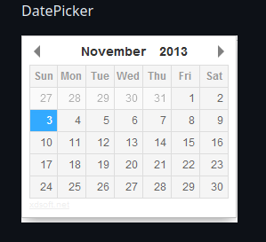
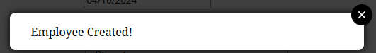
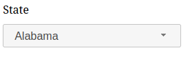
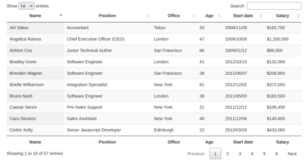
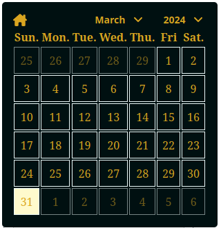

# Project 14 : Faire passer une librairie jQuery vers React

Last project of the online training "Développeur d'application Javascript / React", last but not the least.

It is developed with React and Vite.js.

The goal was to create a React version of a JQuery app. \
It was also asked to create a plugin to replace the four JQuery ones and publish it to npm.

JQuery plugins realised in React:

- [Date selection](https://github.com/xdan/datetimepicker)

- [Modal window](https://github.com/kylefox/jquery-modal)

- [A select component](https://github.com/jquery/jquery-ui/blob/master/ui/widgets/selectmenu.js)

- [Data table](https://github.com/DataTables/DataTables)

I choose to created the date selection plugin. The source code is available [here](https://github.com/empostigo/em-react-calendar) \
And it is available [here](https://www.npmjs.com/package/em-react-calendar) on the npm site.

## Installation

### Runtime

nodejs LTS version `20.11.1`

### Installation / Usage

- Clone it
- `cd HRnet`
- `npm i`

To launch the site:

- `npm run build`
- `npm run preview`

## Demo site

On netlify: [https://oc-hrnet.empostigo.dev](https://oc-hrnet.empostigo.dev)